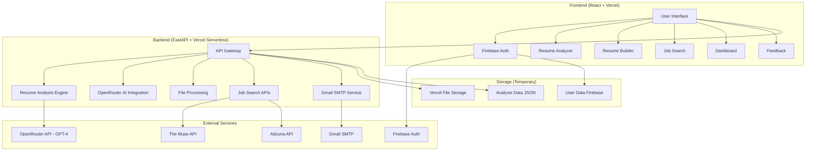
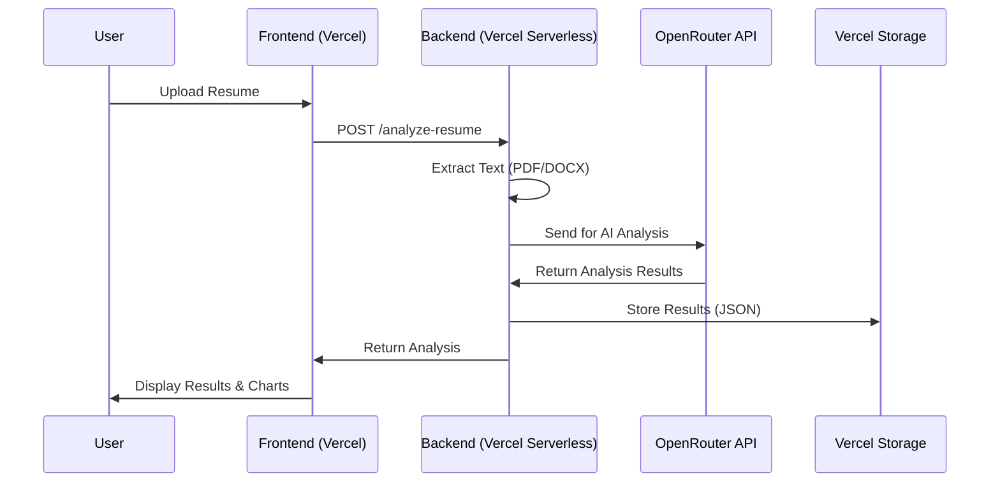

<div align="center">

# 🚀 CVision Smart Resume Analyzer

**An AI-powered resume analysis and career advancement platform**

## 📋 Table of Contents

</div>

- [🎯 Overview](#-overview)
- [✨ Features](#-features)
- [🏗️ Architecture](#️-architecture)
- [🛠️ Tech Stack](#️-tech-stack)
- [Project Structure](#-project-structure)
- [🚀 Quick Start](#-quick-start)
- [⚙️ Configuration](#️-configuration)
- [🔧 Development](#-development)
- [API Documentation](#-api-documentation)
- [🚀 Deployment](#-deployment)
- [🤝 Contributing](#-contributing)
- [📞 Contact](#-contact)

---

## 🎯 Overview

**CVision Smart Resume Analyzer** is a comprehensive career advancement platform that combines cutting-edge AI technology with intuitive design to help job seekers optimize their resumes and advance their careers. The platform offers both standard algorithmic analysis and advanced AI-powered insights to provide personalized feedback and recommendations.

### Mission Statement

CVision represents our vision of democratizing career advancement through technology. By combining cutting-edge AI with intuitive design, this platform empowers job seekers at every career stage to showcase their true potential and stand out in today's competitive job market.

## ✨ Features

### 🔍 Resume Analysis
- **Dual Analysis Modes**: Standard algorithmic analysis and AI-powered insights
- **ATS Optimization**: Ensures compatibility with Applicant Tracking Systems
- **Keyword Matching**: Analyzes resume against job-specific requirements
- **Format Scoring**: Evaluates resume structure and presentation
- **Section Analysis**: Identifies missing or weak resume sections
- **Contact Information Validation**: Checks for essential contact details

### 🤖 AI-Powered Insights
- **GPT-4 Integration**: Advanced AI analysis using OpenRouter API
- **Personalized Recommendations**: Tailored suggestions based on target role
- **Job Description Matching**: Compares resume against specific job requirements
- **Skill Gap Analysis**: Identifies missing skills and competencies
- **Content Optimization**: Suggests improvements for better impact

### 📝 Resume Builder
- **Multiple Templates**: Modern, Professional, Minimal, and Creative designs
- **Real-time Preview**: Live preview of resume as you build
- **Export Options**: Download as DOCX format
- **Section Management**: Easy addition and organization of resume sections
- **Skills Categorization**: Technical, soft skills, languages, and tools

### 🔍 Job Search Integration
- **Real Job Listings**: Live data from The Muse API and Adzuna API
- **Advanced Filtering**: Search by company, location, experience level
- **Pagination**: Infinite scroll for seamless browsing
- **External Links**: Direct access to company career pages
- **Rate Limit Handling**: Graceful management of API limits

### 📊 Dashboard & Analytics
- **Analysis History**: Track all previous resume analyses
- **Performance Metrics**: Visual charts and statistics
- **Download Options**: Access to original uploaded files
- **Progress Tracking**: Monitor improvement over time

### 🔐 User Authentication
- **Firebase Integration**: Secure user authentication
- **Protected Routes**: Access control for premium features
- **User Profiles**: Personalized experience and data storage

### 💬 Feedback System
- **User Feedback Collection**: Comprehensive feedback forms
- **Email Notifications**: Automatic email delivery to team (`22it084@charusat.edu.in` & `22it157@charusat.edu.in`)
- **Rating System**: 5-star rating with detailed comments
- **Contact Integration**: Direct communication channels

---

## 🏗️ Architecture

### System Architecture Overview



### Data Flow Architecture



---

## 🛠️ Tech Stack

### Frontend Technologies
- **React 18** - Modern UI library with hooks and concurrent features
- **React Router v6** - Client-side routing and navigation
- **Tailwind CSS 3** - Utility-first CSS framework
- **Framer Motion** - Advanced animations and transitions
- **Chart.js + react-chartjs-2** - Data visualization and analytics
- **React Dropzone** - File upload handling
- **Axios** - HTTP client for API communication
- **React Toastify** - User notifications and feedback
- **Lucide React** - Modern icon library
- **Firebase** - Authentication and user management

### Backend Technologies
- **FastAPI** - Modern, fast web framework for building APIs
- **Python 3.11** - Core programming language
- **Uvicorn** - ASGI server for FastAPI
- **Pydantic** - Data validation and settings management
- **OpenAI API** - AI-powered analysis via OpenRouter
- **PDFMiner** - PDF text extraction
- **python-docx** - Microsoft Word document processing
- **httpx** - Async HTTP client for external APIs
- **python-dotenv** - Environment variable management

### External Services
- **OpenRouter API** - AI model access (GPT-4)
- **The Muse API** - Job listings and company data
- **Adzuna API** - Additional job search data
- **Gmail SMTP** - Email delivery service
- **Firebase** - User authentication and management

### Deployment & Hosting
- **Vercel** - Primary hosting platform (Frontend + Backend)
- **Heroku** - Alternative deployment option
- **Vercel Serverless Functions** - Backend API hosting
- **Vercel Static Hosting** - Frontend hosting

### Development Tools
- **Create React App** - React development environment
- **PostCSS + Autoprefixer** - CSS processing
- **ESLint** - Code linting and quality
- **Jest** - Testing framework
- **Git** - Version control

---

## 📁 Project Structure

```
CVision-Smart-Resume-Analyzer/
├── 📁 frontend/                    # React frontend application
│   ├── 📁 public/                   # Static assets
│   │   ├── index.html              # Main HTML template
│   │   └── manifest.json           # PWA manifest
│   ├── 📁 src/                     # Source code
│   │   ├── 📁 components/          # Reusable components
│   │   │   ├── BeamsBackground.js # Animated background
│   │   │   ├── Navbar.js          # Navigation component
│   │   │   ├── ProtectedRoute.js  # Route protection
│   │   │   ├── ResumeChart.js     # Analytics charts
│   │   │   └── TypingHero.js      # Hero animation
│   │   ├── �� context/             # React context providers
│   │   │   ├── AuthContext.js     # Authentication state
│   │   │   └── JobRolesContext.js # Job data management
│   │   ├── �� pages/               # Page components
│   │   │   ├── About.js           # About page
│   │   │   ├── Auth.js            # Login/signup
│   │   │   ├── Dashboard.js       # User dashboard
│   │   │   ├── Feedback.js        # Feedback form
│   │   │   ├── Home.js            # Landing page
│   │   │   ├── JobSearch.js       # Job search interface
│   │   │   ├── ResumeAnalyzer.js  # Resume analysis
│   │   │   └── ResumeBuilder.js   # Resume builder
│   │   ├── firebase.js             # Firebase configuration
│   │   ├── index.css              # Global styles
│   │   ├── index.js               # App entry point
│   │   └── App.js                 # Main app component
│   ├── 📁 build/                   # Production build output
│   ├── package.json               # Dependencies and scripts
│   ├── tailwind.config.js         # Tailwind configuration
│   ├── postcss.config.js          # PostCSS configuration
│   ├── Procfile                   # Heroku deployment config
│   └── README.md                  # Frontend documentation
├── �� backend/                     # FastAPI backend application
│   ├── 📁 api/                    # Vercel serverless entry point
│   │   └── index.py              # Vercel function handler
│   ├── 📁 storage/                # Data storage
│   │   └── analyses.json          # Analysis results
│   ├── 📁 uploads/                # File uploads (temporary)
│   │   └── *.pdf                 # Uploaded resumes
│   ├── main.py                    # Main FastAPI application
│   ├── requirements.txt           # Python dependencies
│   ├── roles.json                 # Job roles dataset
│   ├── Procfile                  # Heroku deployment config
│   ├── runtime.txt               # Python version (3.11.0)
│   └── env-template.txt          # Environment variables template
├── 📁 api/                        # Additional API modules
│   ├── analyze-resume.js         # Resume analysis logic
│   ├── job_categories.js         # Job categories data
│   ├── job_roles.js              # Job roles data
│   ├── job-categories.js         # Alternative categories
│   ├── job-roles.js              # Alternative roles
│   └── jobs.js                   # Job search logic
├── �� vercel.json                # Vercel deployment configuration
├── 📄 vercel-env-template.txt     # Vercel environment variables
├── 📄 VERCEL_DEPLOYMENT_GUIDE.md # Vercel deployment instructions
├── 📄 HEROKU_COMMANDS.md         # Heroku deployment guide
├── 📄 deploy-heroku.ps1          # Heroku deployment script
├── 📄 setup-heroku.ps1           # Heroku setup script
├── 📄 deploy-to-heroku.md        # Heroku documentation
├── 📄 test_muse_integration.py   # API testing script
├── 📄 heroku-installer.exe       # Heroku CLI installer
└── 📄 README.md                  # This file
```

---

## 🚀 Quick Start

### Prerequisites

- **Node.js 18+** and npm
- **Python 3.11+** and pip
- **Git** for version control

### 1. Clone the Repository

```bash
git clone https://github.com/Siddhi1604/CVision-Smart-Resume-Analyzer.git
cd CVision-Smart-Resume-Analyzer
```

### 2. Backend Setup

```bash
# Navigate to backend directory
cd backend

# Create virtual environment
python -m venv venv

# Activate virtual environment
# Windows:
venv\Scripts\activate
# macOS
